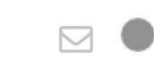

# Ripple Button

A reusable component that features a button `com.mig82.RippleButton` which
displays a Material Theme ripple effect when being clicked.

Here are some examples of what this looks like:

### Floating Button

### Menu Button

### Block Button

## Implementation Notes

This project was built using Kony Quantum 8.4.43.

## Other Considerations

This component uses Font Awesome for the button icons. You'll have to import
other icon fonts and modify the skins if you wish to use another.
